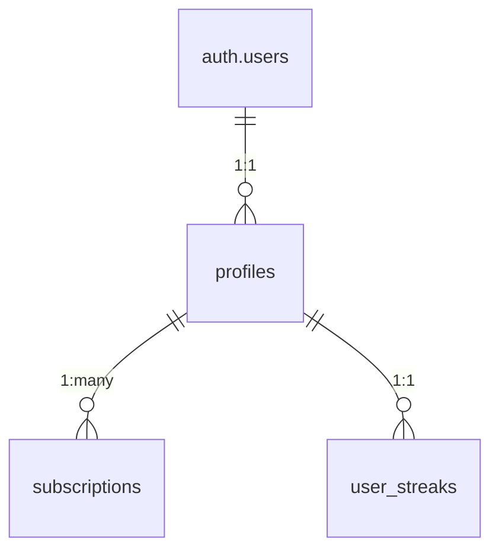

# Sports Genius Database Schema Review

## Core Tables

### `profiles`
- Stores user profile data
- Columns:
  - `id` (UUID) - Primary key, references auth.users
  - `email` (TEXT) - User email
  - `trial_ends_at` (TIMESTAMPTZ) - Trial expiration timestamp
  - `created_at` (TIMESTAMPTZ) - Default now()
  - `updated_at` (TIMESTAMPTZ) - Default now()
- RLS Policies:
  - Users can view own profile
  - Users can update own profile

### `subscriptions`
- Tracks user subscription status
- Columns:
  - `id` (UUID) - Primary key
  - `user_id` (UUID) - References profiles(id)
  - `status` (TEXT) - Subscription status
  - `stripe_customer_id` (TEXT) - Stripe customer ID
  - `stripe_subscription_id` (TEXT) - Stripe subscription ID
  - `current_period_end` (TIMESTAMPTZ) - Subscription period end
  - `created_at` (TIMESTAMPTZ) - Default now()
  - `updated_at` (TIMESTAMPTZ) - Default now()
- RLS Policies:
  - Users can view own subscriptions

### `ai_models`
- Stores AI model configurations
- Columns:
  - `id` (UUID) - Primary key
  - `title` (TEXT) - Model title
  - `description` (TEXT) - Model description
  - `sport` (TEXT) - Associated sport
  - `model_type` (TEXT) - Model type
  - `visibility` (TEXT) - Default 'public'
  - `input_schema` (JSONB) - Input schema
  - `prompt_template` (TEXT) - Prompt template
  - `created_at` (TIMESTAMPTZ) - Default now()
  - `updated_at` (TIMESTAMPTZ) - Default now()
- RLS Policies:
  - Public read access for public models
  - Full access for admins

### `api_keys`
- Stores API keys for providers
- Columns:
  - `id` (UUID) - Primary key
  - `provider` (TEXT) - Provider name
  - `api_key` (TEXT) - API key value
  - `is_active` (BOOLEAN) - Default TRUE
  - `created_at` (TIMESTAMPTZ) - Default now()
  - `updated_at` (TIMESTAMPTZ) - Default now()
- RLS Policies:
  - Full access for admins only

### `user_streaks`
- Tracks user activity streaks
- Columns:
  - `user_id` (UUID) - Primary key, references auth.users
  - `credits` (INTEGER) - Default 0
  - `last_activity` (TIMESTAMPTZ) - Default now()
- RLS Policies:
  - Users can view own streak
  - Users can update own streak

## Storage

### `bet-slips` Bucket
- Stores user bet slips
- Configuration:
  - Private bucket (not public)
  - RLS Policies:
    - Users can upload their own bet slips
    - Users can view their own bet slips

## Functions & Triggers

### `handle_new_user()`
- Creates profile record when new auth user is created
- Trigger: `on_auth_user_created` after insert on `auth.users`

## Key Relationships

## Recommendations for Analytics Panel
1. Add `user_activity_logs` table for tracking:
   - User logins
   - Model usage
   - Feature interactions

2. Consider adding `admin_metrics` materialized view for:
   - Daily active users
   - MRR calculations
   - API call volumes

3. Add indexes for analytics queries:
   - `created_at` on all tables
   - `status` on subscriptions
   - `sport` on ai_models
